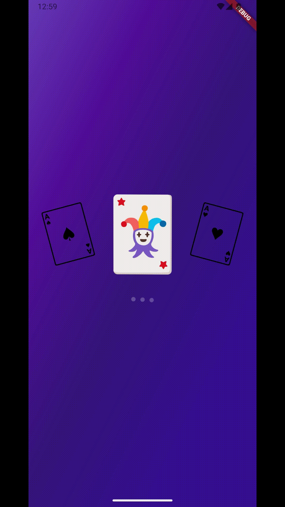
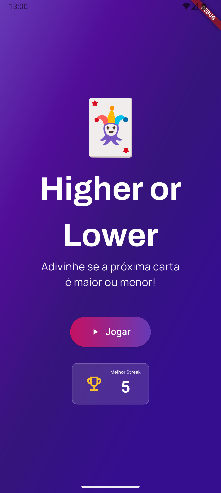
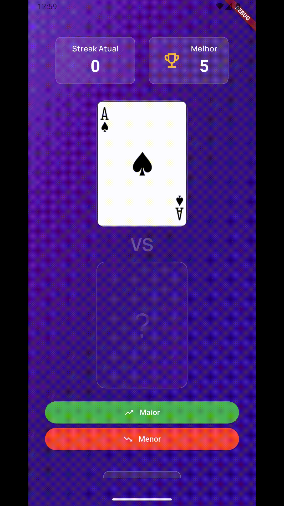
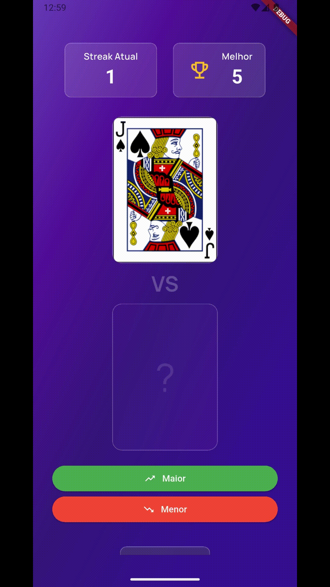

# 🃏 Higher or Lower - Flutter

Um jogo de cartas desafiador desenvolvido em Flutter, onde o objetivo é adivinhar se a próxima carta do baralho será maior ou menor que a carta atual.

## 📌 Tecnologias Utilizadas

- **Flutter + Dart**
- **GetX** (Gerenciamento de estado, rotas e dependências)
- **Dio** (Consumo da Deck of Cards API)
- **Custom Animations** (Splash screen animada, flip de cartas 3D, efeitos de confete e feedbacks visuais)
- **Material 3** (Design moderno e adaptativo)

## 🚀 Como Executar

1. **Clone o repositório:**

   ```sh
   git clone https://github.com/erizoka/higher-or-lower
   cd higher_or_lower
   ```

2. **Instale as dependências:**

   ```sh
    flutter pub get
   ```

3. **Execute o app:**

   ```sh
    flutter run
   ```

## 🔍 Funcionalidades

- **Mecânica de Jogo**: Interface intuitiva para palpites de "Maior" ou "Menor".
- **Integração com API**: Utiliza a [Deck of Cards API](https://deckofcardsapi.com/) para gerar baralhos reais e embaralhados.
- **Sistema de Streak**: Acompanhamento em tempo real da sequência atual de acertos e recorde pessoal (Best Streak).
- **Feedback Visual 3D**: Animação de virada de carta com perspectiva realista usando transformações de matriz.
- **Efeitos Dinâmicos**: Animações de confete em caso de vitória e indicadores visuais de acerto/erro.
- **Persistência**: Salvamento automático do melhor streak do jogador.

## 📷 Capturas de Tela

### Splash e Home
<p>
  
  
</p>

### Feedback e Animações
<p>
  
  
</p>

## 📄 Licença

Este projeto está sob a licença MIT. Veja o arquivo [LICENSE](LICENSE) para mais detalhes.

---

Desenvolvido por [Erica Esteves](https://github.com/erizoka). 🚀
